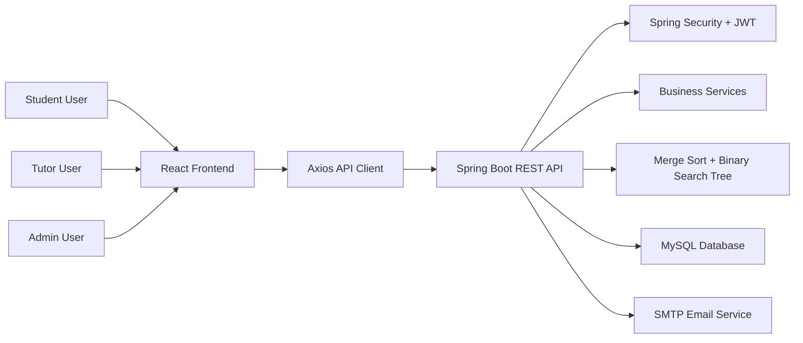
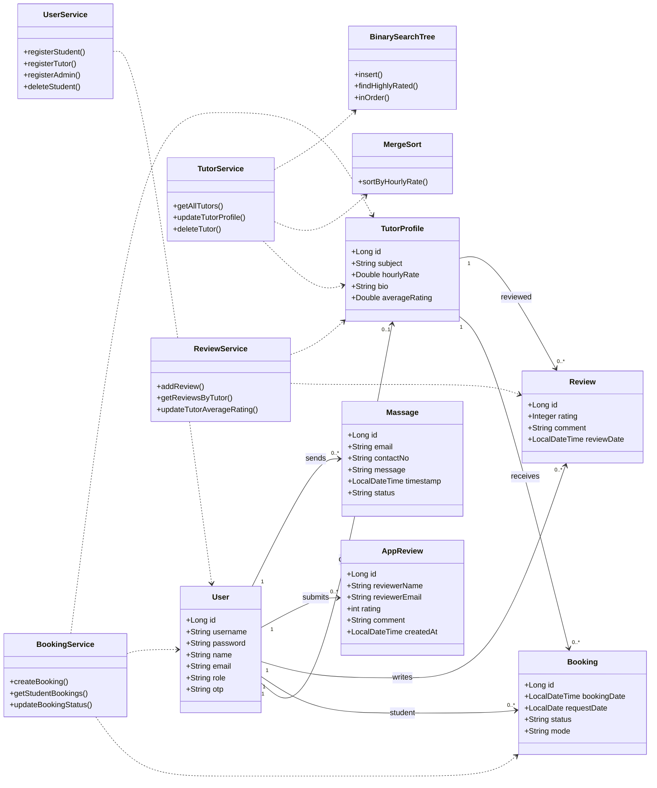

<div align="center">

<h1 style="
  font-size: 3.5rem;
  font-weight: 900;
  background: linear-gradient(90deg,#00F5FF,#7B2FF7,#FF4FD8,#00F5FF);
  -webkit-background-clip: text;
  -webkit-text-fill-color: transparent;
  text-shadow:
    0 0 10px rgba(0,245,255,0.8),
    0 0 20px rgba(123,47,247,0.8),
    0 0 40px rgba(255,79,216,0.8);
  margin-bottom: 10px;
">
  Home Tutor Search & Booking System
</h1>

<p style="
  font-size: 1.2rem;
  color: #cfcfcf;
  letter-spacing: 1px;
">
  Smart • Fast • Modern Tutor Booking Platform
</p>


### A full-stack web application for discovering tutors, managing bookings, and running student-tutor-admin workflows.

## Demo Video
https://github.com/user-attachments/assets/ed2b8641-13d8-4574-b20e-d364d4dc4122


</div>

---

## Overview

The **Home Tutor Search & Booking System** is an Object-Oriented Programming project built as a modern full-stack platform. It connects students with tutors, supports secure authentication, manages bookings, enables tutor reviews, and gives admins control over users, messages, and booking status.

The project is split into two main applications:

- **Frontend:** React + Vite single-page application
- **Backend:** Java Spring Boot REST API with MySQL persistence

---

## Core Features

### Student

- Register and log in securely
- Browse available tutors
- Search tutors by subject and profile details
- Book tutoring sessions
- Track booking status
- Leave tutor reviews after completed sessions
- Contact support
- Reset forgotten passwords

### Tutor

- Register as a tutor
- Manage tutor profile information
- View assigned booking requests
- Accept or reject booking requests
- Receive student ratings and reviews

### Admin

- Access protected admin dashboard
- View and manage students
- View all booking records
- Update booking statuses
- Delete students or bookings
- View and manage support/contact messages
- Monitor application-level reviews

### Smart Search & DSA

This project includes custom Data Structures and Algorithms logic:

- **Merge Sort** for sorting tutor data, such as tutor rate
- **Binary Search Tree** for efficient tutor filtering/search support

---

## Tech Stack

| Layer | Technologies |
|---|---|
| Frontend | React 19, Vite, React Router DOM, Axios, CSS |
| Backend | Java 21, Spring Boot 3.2.4, Spring Web, Spring Security, Spring Data JPA |
| Authentication | JWT, role-based authorization |
| Database | MySQL |
| Email | Spring Mail with SMTP relay support |
| Build Tools | Maven, npm |
| Deployment Ready | Vercel config for frontend, Spring Boot executable backend |

---

## System Architecture



---

## UML Class Diagram



---

## Project Structure

```text
OOP_Project/
|-- front_end/
|   |-- src/
|   |   |-- api/
|   |   |-- components/
|   |   |-- context/
|   |   |-- pages/
|   |   `-- styles/
|   |-- package.json
|   `-- vite.config.js
|
|-- back_end/
|   |-- src/main/java/com/university/hometutor/
|   |   |-- admin/
|   |   |-- booking/
|   |   |-- config/
|   |   |-- messaging/
|   |   |-- Review/
|   |   |-- searchandfilter/
|   |   |-- tutormanagement/
|   |   |-- usermanagement/
|   |   `-- Util/
|   |-- src/main/resources/application.properties
|   `-- pom.xml
|
`-- README.md
```

---

## Frontend

The frontend is a React single-page application built with Vite. It communicates with the backend API using a centralized Axios instance.

### Frontend Style

The UI uses a polished **dark glassmorphism** design system with a premium dashboard feel.

| Design Area | Implementation |
|---|---|
| Theme | Deep dark background with layered surfaces |
| Typography | Inter font family with bold hero headings |
| Primary Color | `#6C63FF` purple |
| Accent Color | `#00BFA5` teal |
| Error Color | `#FF6B6B` soft red |
| Cards | Transparent glass panels with blur and subtle borders |
| Buttons | Gradient primary buttons with hover lift and shadow |
| Inputs | Dark translucent fields with purple focus ring |
| Motion | Floating hero orbs, spinner animation, hover transitions |
| Hero Style | Full-screen video background with dark overlay |

Main style files:

```text
front_end/src/styles/index.css
front_end/src/pages/Home/Home.css
```

### Frontend Highlights

- React Router navigation
- JWT token storage in `localStorage`
- Protected routes for authenticated users
- Admin-only protected route support
- Role-based navigation after login
- Pages for home, login, registration, dashboard, tutors, tutor profile, students, support, and admin
- Vercel rewrite configuration included

### Frontend Setup

```bash
cd front_end
npm install
npm run dev
```

Frontend development server:

```text
http://localhost:5173
```

### Frontend Build

```bash
npm run build
```

### Frontend Preview

```bash
npm run preview
```

### Frontend API Configuration

The frontend API base URL is configured in:

```text
front_end/src/api/axiosInstance.js
```

Default local backend URL:

```text
http://localhost:10000/api
```

Change this value when deploying to production.

---

## Backend

The backend is a Spring Boot REST API that handles authentication, users, tutors, bookings, reviews, support messages, email, and database persistence.

### Backend Highlights

- REST API architecture
- JWT authentication
- Spring Security configuration
- Student, tutor, and admin role workflows
- Microsoft SQL Server database integration using Spring Data JPA
- Booking management
- Tutor review management
- Application review support
- Contact/support message management
- Password reset and email support
- Custom DSA package for tutor searching and sorting

### Backend Setup

```bash
cd back_end
mvn spring-boot:run
```

Backend server:

```text
http://localhost:10000
```

### Database Setup

Create the SQL Server database:

```sql
CREATE DATABASE hometutor_database;
```

Copy `.env.example` to `.env` and set the SQL Server and JWT credentials. The `.env` file is loaded automatically by Spring Boot and is ignored by Git.

> Important: Do not commit real database passwords, JWT secrets, or SMTP credentials to GitHub. Use environment variables or a private local config for production.

### Deployment

The frontend deploys to Vercel and the backend deploys to Railway.

#### Vercel

- Set the project root directory to `front_end`.
- Build command: `npm run build`.
- Output directory: `dist`.
- Add `VITE_API_BASE_URL` with the public Railway backend URL, for example `https://your-backend.up.railway.app`.

#### Railway

- Create a service using the `back_end/Dockerfile`.
- Set the service root directory to `back_end`.
- Railway supplies `PORT`; the backend is configured to use it automatically.
- Set `FRONTEND_URL` to the Vercel deployment URL.
- Configure the `MSSQL_*`, `JWT_SECRET`, and `MAIL_*` environment variables in Railway.
- Verify the service with `/actuator/health`.

Railway does not provide a native Microsoft SQL Server service. Use a reachable managed SQL Server instance such as Azure SQL, and restrict its firewall to trusted Railway egress where possible.

---

## Main API Endpoints

### Authentication

| Method | Endpoint | Description |
|---|---|---|
| POST | `/api/auth/login` | User login |
| POST | `/api/auth/send-2fa-code` | Send two-factor authentication code |
| POST | `/api/auth/register/student` | Register student |
| POST | `/api/auth/register/tutor` | Register tutor |
| POST | `/api/auth/register/admin` | Register admin |
| POST | `/api/auth/forgot-password` | Request password reset |
| POST | `/api/auth/reset-password` | Reset password |

### Tutors

| Method | Endpoint | Description |
|---|---|---|
| GET | `/api/tutors` | Get tutors |
| GET | `/api/tutors/subjects` | Get available subjects |
| GET | `/api/tutors/{id}` | Get tutor by ID |
| PUT | `/api/tutors/{id}` | Update tutor profile |
| DELETE | `/api/tutors/{id}` | Delete tutor |
| GET | `/api/tutors/my-bookings` | Get tutor bookings |
| PUT | `/api/tutors/bookings/{bookingId}/status` | Update tutor booking status |

### Students

| Method | Endpoint | Description |
|---|---|---|
| GET | `/api/students/{studentId}/bookings` | Get student bookings |
| POST | `/api/students/{studentId}/book/{tutorId}` | Book a tutor |

### Admin

| Method | Endpoint | Description |
|---|---|---|
| GET | `/api/admin/bookings` | Get all bookings |
| GET | `/api/admin/getStudents` | Get all students |
| DELETE | `/api/admin/students/{id}` | Delete student |
| PUT | `/api/admin/bookings/{bookingId}/status` | Update booking status |
| DELETE | `/api/admin/bookings/{id}` | Delete booking |

### Reviews & Messages

| Method | Endpoint | Description |
|---|---|---|
| POST | `/api/reviews` | Add tutor review |
| GET | `/api/reviews/tutor/{tutorId}` | Get tutor reviews |
| POST | `/api/Appreviews/add` | Add application review |
| GET | `/api/Appreviews/get` | Get application reviews |
| POST | `/api/contact` | Send contact message |
| GET | `/api/contact/getAllMassages` | Get all contact messages |
| DELETE | `/api/contact/{id}` | Delete contact message |
| PUT | `/api/contact/{id}/status` | Update contact message status |

---

## How to Run the Full Project

### 1. Start MySQL

Make sure MySQL is running locally on:

```text
localhost:3306
```

Create the database:

```sql
CREATE DATABASE hometutor_db;
```

### 2. Start the Backend

```bash
cd back_end
mvn spring-boot:run
```

Backend runs on:

```text
http://localhost:10000
```

### 3. Start the Frontend

Open a second terminal:

```bash
cd front_end
npm install
npm run dev
```

Frontend runs on:

```text
http://localhost:5173
```

---

## Demo Flow

1. Register a tutor account and complete tutor profile details.
2. Register a student account.
3. Log in as the student.
4. Browse/search tutors and book a tutor.
5. Log in as the tutor and accept or reject the request.
6. Log in as admin and update booking status if needed.
7. Return as student and leave a review after completion.
8. Test support/contact messages and admin message management.

---

## Security Notes

- JWT is used to authenticate API requests.
- Protected frontend routes prevent unauthorized page access.
- Admin pages are restricted to configured admin users.
- Backend security rules protect private endpoints.
- Password reset uses email service support.
- Production deployments should use environment variables for secrets.

---

## Future Improvements

- Add payment integration for paid tutor bookings
- Add live chat between students and tutors
- Add tutor availability calendar
- Add notification center
- Add automated backend and frontend tests
- Add Docker support for easier deployment
- Add cloud database configuration

---

## Author

Developed as a university Object-Oriented Programming project.

<div align="center">

### Built with Java, Spring Boot, React, MySQL, and custom DSA logic.

</div>
